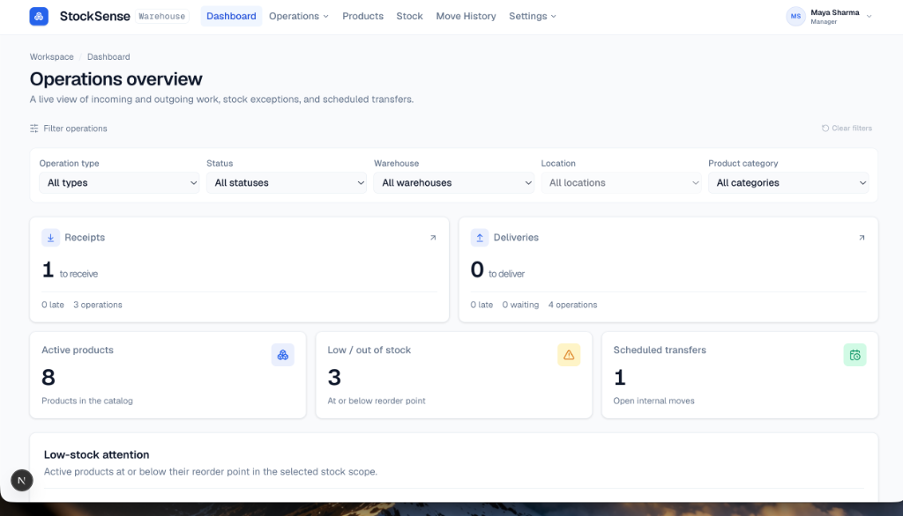
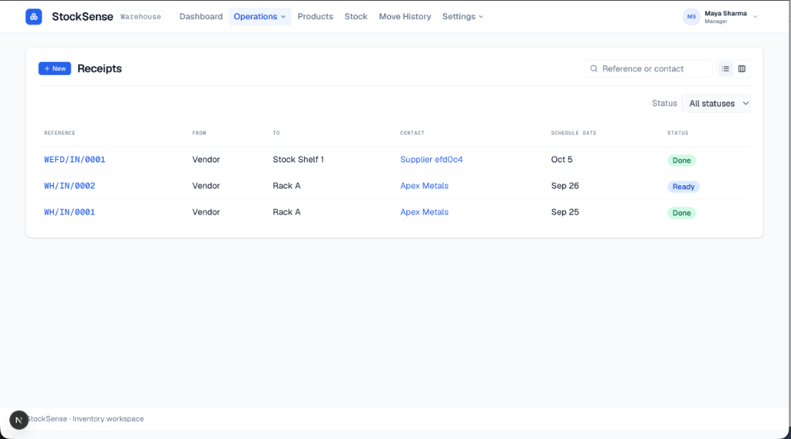
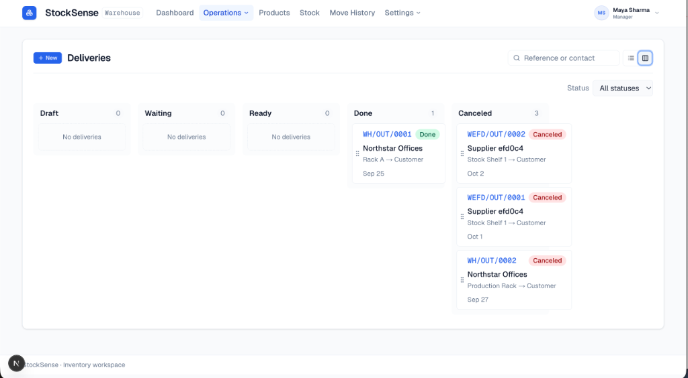
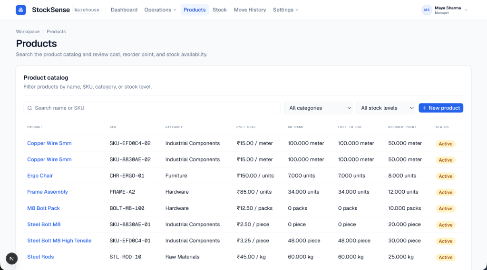
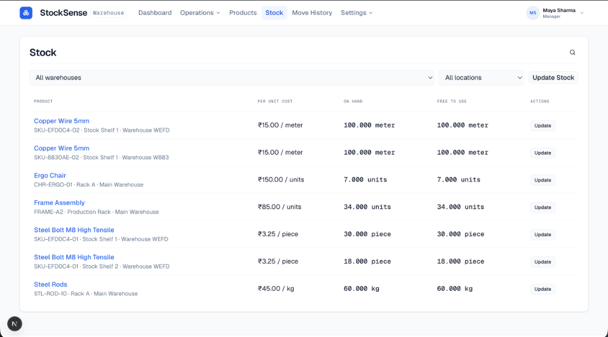

# StockSense

StockSense — Intelligent stock and inventory outlier analysis platform developed for the Odoo Hackathon.

## Previews

### Operations Dashboard
A live view of incoming and outgoing work, stock exceptions, and scheduled transfers.


### Operations — Receipts
Track and process incoming inventory receipts and vendor shipments.


### Operations — Deliveries (Kanban)
Interactive Kanban board for managing deliveries across Draft, Waiting, Ready, Done, and Canceled stages.


### Product Catalog
Detailed product catalog with unit costs, inventory availability, and reorder point monitoring.


### Stock Management
Multi-warehouse and location-level stock breakdown with quick stock update capabilities.


## Team Outliers

| Member | Role |
|--------|------|
| **Sourabh Chouhan** | Frontend Lead — React/Next.js pages, routing, API integration, demo click-path, responsive layouts |
| **Kunal Waghe** | Backend — Python API, business logic, auth, database schema/migrations, seed data, deployment |
| **Hardik Singh Chouhan** | UI Kit & QA — shared components, loading/empty/error states, component quality, bug bash, demo testing |

## Repository Structure

- `frontend/`: Next.js 16 (React 19, TypeScript, Tailwind CSS v4, Base UI / Shadcn) application.
- `DESIGN.md`: Comprehensive design tokens, typography, colors, and UI specifications.

## Frontend Setup & Development

To get started with the frontend:

```bash
cd frontend
npm install
npm run dev
```

Open [http://localhost:3000](http://localhost:3000) with your browser to view the application.

### Scripts

- `npm run dev`: Launch the Next.js development server with Turbopack.
- `npm run build`: Build the production application.
- `npm run start`: Start the production server.
- `npm run lint`: Run ESLint.
